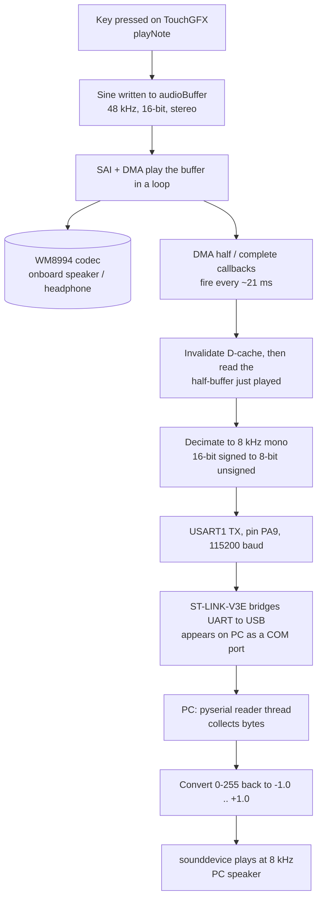

# STM32H747I-DISCO Keyboard → PC Audio Streaming over UART

A detailed report of the working system: the end-to-end flow, the firmware that
runs on the board, and the Python script that plays the audio on the PC. It also
records the two non-obvious problems that had to be solved (a Cortex-M7 cache
issue and a clock/SAI subtlety), because those are the parts most likely to be
forgotten and re-broken later.

---

## 1. Overview

The board runs a touchscreen piano keyboard (built with TouchGFX). When a key is
pressed it synthesises a tone and plays it locally through the onboard audio
codec. This project adds a second output: the same audio is reduced to a light
format and streamed over a serial link to a PC, where a small Python program
plays it through the computer's speakers in real time.

The core idea throughout is that **sound is just a stream of numbers**. The board
produces those numbers, ships them out one byte at a time over the serial line,
and the PC turns them back into sound. Everything else is detail in service of
that.

The serial link uses the board's on-board ST-LINK debugger, which exposes one of
the MCU's UARTs to the PC as an ordinary COM port. This means no extra wiring and
no USB-to-serial adapter: the same cable used to program the board also carries
the audio.

---

## 2. End-to-end flow



The pipeline has three zones. On the **board**, tones are generated, played
locally, and tapped. The **serial link** carries the bytes to the PC through the
ST-LINK. On the **PC**, a background thread collects the bytes and an audio
callback plays them.

A key property: the tap runs off the audio DMA's own interrupts, which fire
continuously as the playback buffer loops, completely independent of when keys
are pressed. So the stream is steady and self-paced rather than bursty.

---

## 3. The board side

### 3.1 How a tone is generated

When a key is pressed, the TouchGFX view calls `playNote(frequency)`, which calls
`generateSineWithAmplitude`. That function fills a stereo buffer
(`audioBuffer`, 4096 `int16` values) with a sine wave at the note's frequency.
Two details matter:

- The sine is generated so that a **whole number of cycles** fits the buffer.
  Because the buffer is played in a continuous loop, the end has to line up with
  the start, or there would be an audible click on every wrap.
- The samples are written at **full amplitude** and never changed for volume. The
  attack/release envelope and the volume slider are applied separately, by setting
  the **codec's hardware volume** (`BSP_AUDIO_OUT_SetVolume`). So the buffer always
  holds either a full-volume tone or silence.

That second point has a consequence for the stream, discussed in section 7.

### 3.2 How audio plays continuously

`setupScreen()` calls `BSP_AUDIO_OUT_Play(...)` once. This starts the SAI
peripheral feeding the WM8994 codec via DMA in **circular mode**. Once started,
the DMA walks through `audioBuffer` and, on reaching the end, wraps back to the
start and continues — forever, with no CPU involvement. A new note is heard simply
by rewriting the buffer contents while the DMA keeps looping.

Because the DMA loops continuously, it raises an interrupt at the **halfway** point
and again at the **end** of every pass. With a 4096-sample stereo buffer (2048
frames) at 48 kHz, each pass takes about 42.7 ms, so these interrupts fire roughly
every 21 ms. They surface to user code as two BSP callbacks. This steady ~21 ms
heartbeat is what the audio tap hooks into.

### 3.3 The audio tap (the code added for streaming)

Two things are added to `Screen1View.cpp`.

First, near the top of the file (after the includes), a reference to the UART
handle that CubeMX generates in `main.c`:

```cpp
extern "C" UART_HandleTypeDef huart1;   // USART1 = the ST-LINK virtual COM port
```

The `extern "C"` is required because this is a C++ file and the handle has C
linkage.

Then the tap itself — one helper plus the two BSP callbacks it overrides:

```cpp
// Take one half of the 48 kHz stereo buffer, shrink to 8 kHz mono 8-bit,
// and push it out the serial port.
static void streamHalfToUart(int startIndex)
{
    static uint8_t txbuf[200];
    int k = 0;

    // CRITICAL on Cortex-M7: pull the real samples from RAM, not stale cache.
    SCB_InvalidateDCache_by_Addr((uint32_t*)&audioBuffer[startIndex],
                                 (BUFFER_SIZE / 2) * sizeof(int16_t));

    // step 12 int16 = skip 6 stereo frames -> 48000/6 = 8000 Hz; left channel only
    for (int i = startIndex; i < startIndex + (BUFFER_SIZE / 2); i += 12)
    {
        int16_t s = audioBuffer[i];                 // one sample
        txbuf[k++] = (uint8_t)((s >> 8) + 128);     // 16-bit signed -> 0..255
    }
    HAL_UART_Transmit_IT(&huart1, txbuf, k);
}

extern "C" void BSP_AUDIO_OUT_HalfTransfer_CallBack(uint32_t Instance)
{
    streamHalfToUart(0);                  // first half just finished playing
}

extern "C" void BSP_AUDIO_OUT_TransferComplete_CallBack(uint32_t Instance)
{
    streamHalfToUart(BUFFER_SIZE / 2);    // second half just finished playing
}
```

What each part does:

- The two `BSP_AUDIO_OUT_..._CallBack` functions **override** the weak versions in
  the board support package. They fire automatically every ~21 ms as the DMA loops,
  each handed the half of the buffer that was just played. Reading the "just
  played" half avoids reading a region the DMA is actively streaming.
- `streamHalfToUart` reduces that half to the light streaming format. It keeps one
  channel (stereo → mono), takes every sixth frame (48 kHz → 8 kHz), and uses the
  top eight bits with an offset of 128 (16-bit signed → 8-bit unsigned, range
  0–255).
- `HAL_UART_Transmit_IT` sends the bytes in interrupt mode. It returns immediately
  and lets a UART interrupt push the bytes out one at a time, so it adds no
  measurable delay inside the audio callback. (At ~8 KB/s the transmit of one chunk
  finishes well before the next callback, so there is no collision.)

The `SCB_InvalidateDCache_by_Addr` line is the single most important addition —
see section 3.5.

### 3.4 USART1 configuration

USART1 is enabled in CubeMX:

- Mode: Asynchronous, on pins **PA9 (TX) / PA10 (RX)** — the pins the ST-LINK uses
  for its virtual COM port.
- Baud **115200**, 8 data bits, no parity, 1 stop bit.
- USART1 global interrupt enabled (required for interrupt-mode transmit).

On the PC the board appears as a COM port (for example `COM17`). pyserial reads it
like any serial device.

### 3.5 Two gotchas that must stay fixed

**1. The HAL UART module must be enabled.** In `stm32h7xx_hal_conf.h` the line:

```c
#define HAL_UART_MODULE_ENABLED
```

must be uncommented. If it is commented out, `stm32h7xx_hal_uart.c` compiles to
nothing and the linker reports `undefined reference to HAL_UART_Init`,
`HAL_UART_Transmit_IT`, and similar. This define lives in a CubeMX-managed file, so
a regenerate can switch it off again — re-check it after any regeneration.

**2. The data cache must be invalidated before reading the buffer.** This is the
subtle one. The Cortex-M7 has a data cache. `audioBuffer` is written by the CPU and
cleaned to RAM for the SAI DMA. When the tap *reads* `audioBuffer` from the
callback, the CPU can return **stale cached values** instead of what is actually in
RAM and playing. The symptom is distinctive: the board's own audio is perfectly
clean (it plays from RAM via DMA), the serial link is perfectly clean (a test ramp
arrives intact), yet the streamed audio is gritty — because only the buffer *read*
sees corrupted data. Calling `SCB_InvalidateDCache_by_Addr` on the half being read,
just before reading it, forces the CPU to fetch the true samples from RAM and
removes the grit. The buffer's 32-byte alignment and the 0 / half offsets keep the
invalidate region cache-line aligned, which the function requires.

---

## 4. The PC script

The final script uses a background thread to read serial bytes continuously and an
audio callback to play whatever has arrived. This decoupling keeps latency low and
avoids blocking the audio system on the serial line. It also cleans up the port on
exit, which matters when running repeatedly inside an IDE such as Spyder.

```python
import serial, numpy as np, sounddevice as sd, threading, time

PORT = 'COM17'          # the board's ST-LINK COM port (check Device Manager)
BAUD = 115200           # must match the board
RATE = 8000             # samples per second (must match the board)
MAX_LAG = RATE // 10    # cap backlog at ~100 ms to keep latency low

ser = serial.Serial(PORT, BAUD, timeout=0)   # timeout=0 -> non-blocking reads

buf = np.zeros(0, dtype=np.float32)
lock = threading.Lock()
running = True

def reader():
    """Background thread: grab whatever bytes are waiting and queue them."""
    global buf
    while running:
        try:
            n = ser.in_waiting           # how many bytes are ready right now
            if n:
                raw = ser.read(n)        # read only what's available; never blocks
                s = (np.frombuffer(raw, np.uint8).astype(np.float32) - 128) / 128
                with lock:
                    buf = np.concatenate([buf, s])
                    if len(buf) > MAX_LAG:   # trim backlog -> bound the latency
                        buf = buf[-MAX_LAG:]
            else:
                time.sleep(0.001)        # nothing waiting -> brief pause
        except Exception:
            break                        # port closed -> stop quietly

def feed_speaker(outdata, frames, t, status):
    """Called by sounddevice whenever the speaker needs more audio."""
    global buf
    with lock:
        n = min(frames, len(buf))
        outdata[:n, 0] = buf[:n]
        outdata[n:, 0] = 0               # underrun -> silence
        buf = buf[n:]

thread = threading.Thread(target=reader, daemon=True)
thread.start()
try:
    with sd.OutputStream(channels=1, samplerate=RATE,
                         callback=feed_speaker, blocksize=128, latency='low'):
        input("Playing — press Enter to stop\n")
finally:
    running = False                      # signal the reader to stop
    time.sleep(0.05)
    ser.close()                          # always release the port
```

How it works, top to bottom:

- **Settings.** `BAUD` and `RATE` must match the board exactly. `MAX_LAG` caps how
  much audio is allowed to pile up before old samples are dropped — this is the
  latency control.
- **Non-blocking port.** `timeout=0` plus reading only `ser.in_waiting` bytes means
  the read never blocks. This both lowers latency and sidesteps a Windows pyserial
  bug that crashes blocking reads issued from a background thread.
- **Reader thread.** Runs continuously, converting each 0–255 byte back to a float
  between −1.0 and +1.0 and appending to a shared buffer, trimming the backlog to
  stay under `MAX_LAG`.
- **Audio callback.** The sound system pulls from the buffer whenever it needs
  audio; if not enough has arrived it fills the rest with silence. The speaker
  pulls from the program rather than the program pushing to the speaker, which is
  what keeps the timing self-correcting.
- **Cleanup.** The `finally` block stops the thread and closes the port on exit, so
  a later run starts with a clean handle instead of inheriting a dead one.

Required packages: `pip install pyserial sounddevice numpy` (pyserial 3.5 or newer).

### Latency tuning

`MAX_LAG`, `blocksize`, and `latency='low'` together set the responsiveness.
Smaller values are tighter but more prone to clicks if the PC stalls; larger values
are smoother but laggier. `MAX_LAG = RATE // 10` (~100 ms) and `blocksize=128` are a
good balance; raise `MAX_LAG` toward `RATE // 5` if dropouts appear.

---

## 5. Data format and rate budget

| Stage | Sample rate | Resolution | Channels | Data rate |
|---|---|---|---|---|
| Board internal (SAI / codec) | 48 kHz | 16-bit | Stereo | ~192 KB/s |
| Serial stream (UART) | 8 kHz | 8-bit | Mono | ~8 KB/s |
| UART capacity @ 115200 baud, 8N1 | — | — | — | ~11.5 KB/s |

The 8 KB/s stream fits inside the 115200-baud link with headroom. Eight-bit samples
are a deliberate choice: a dropped byte glitches only a single sample and the stream
recovers, whereas a dropped byte in a 16-bit stream would swap high/low bytes and
corrupt everything after it.

---

## 6. Key design decisions and lessons

- **Tap at the DMA callback, not at tone generation.** The tone is generated once
  per key press, but audio plays continuously via the looping DMA. Tapping the
  callback gives a continuous, correctly paced stream; tapping the generator would
  give one burst per press.
- **8 kHz / 8-bit / mono.** The smallest format that still carries recognisable
  piano tones; fits the link comfortably and removes byte-alignment fragility.
- **Interrupt-mode UART transmit.** Returns immediately and is read by the CPU, so
  it adds no delay in the audio callback and needs no cache maintenance on the
  transmit side.
- **The cache invalidate is mandatory, not optional.** On the Cortex-M7 a CPU read
  of a DMA-shared buffer can return stale data. This was the cause of the "gritty
  audio" symptom and is the easiest thing to accidentally remove.
- **The SAI clock is configured by the BSP at runtime.** The CubeMX clock view may
  show the SAI fed from a 400 MHz source and flag it red, but `BSP_AUDIO_OUT_Init`
  reconfigures the SAI clock (via PLL2) when the program runs, so the audio is
  correct regardless. The red marking is cosmetic — but letting CubeMX "auto-resolve"
  the clock tree can overwrite the working CPU PLL, so the clock should be changed
  deliberately and checked with `git diff` after any code generation.

---

## 7. Limitations and possible upgrades

- **No envelope or volume in the stream.** The buffer always holds a full-amplitude
  tone, and the fade/volume are applied by the codec afterwards. So the PC hears
  notes turn cleanly on and off at constant level, without the soft attack/release.
  Adding it means scaling each sample by the current codec volume before converting
  to a byte (requires storing the live volume value where the callback can read it).
- **Telephone-grade quality.** 8 kHz / 8-bit is recognisable but limited. The single
  biggest quality gain is moving to **16-bit** (send both bytes of the sample; on the
  PC read as `int16` and divide by 32768). Doubling the rate to **16 kHz** (decimate
  by 3 instead of 6, set the PC `RATE` to 16000) opens up the high end. Both increase
  the data rate but stay within the link.
- **Mono, one direction.** The stream is one-way and single-voice. Making the board
  appear as a real system microphone would require USB Audio Class instead of a
  serial stream.

---

## 8. Quick reference

| Item | Value |
|---|---|
| Board | STM32H747I-DISCO (Cortex-M7 core) |
| Local audio | SAI1 + DMA to WM8994 codec, 48 kHz / 16-bit / stereo |
| Audio buffer | `audioBuffer`, 4096 `int16`, 32-byte aligned |
| Tap point | `BSP_AUDIO_OUT_HalfTransfer_CallBack` / `..._TransferComplete_CallBack` |
| Conversion | invalidate D-cache, left channel, every 6th frame, `(s >> 8) + 128` |
| Serial port | USART1, TX on PA9, 115200 baud, 8N1 |
| PC link | ST-LINK-V3E virtual COM port (over the programming USB) |
| PC software | Python with `pyserial` (3.5+), `sounddevice`, `numpy` |
| PC playback format | 8 kHz, 8-bit unsigned, mono |
| Required HAL define | `HAL_UART_MODULE_ENABLED` (in `stm32h7xx_hal_conf.h`) |
