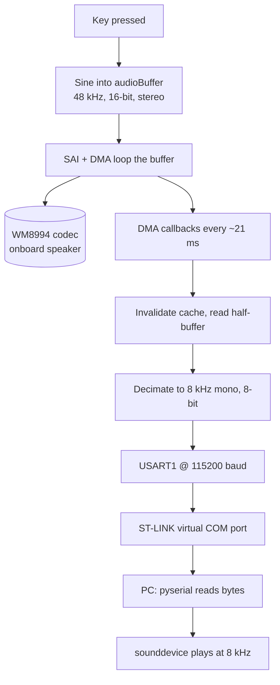

# STM32 Music Keyboard with Live Audio Streaming to PC

A touchscreen piano keyboard for the **STM32H747I-DISCO** board. Pressing a key
synthesises a tone and plays it through the onboard audio codec — and at the same
time streams that audio over a serial link to a PC, where a small Python script
plays it through the computer's speakers in real time.

The serial link runs through the board's on-board ST-LINK, which appears on the PC
as an ordinary COM port. No extra wiring or USB-to-serial adapter is needed: the
same cable that programs the board also carries the audio.

---

## Features

- Touchscreen piano keyboard built with TouchGFX (two octaves, octave shift,
  volume control, attack/release envelope).
- Real-time sine-wave synthesis played locally via SAI + DMA to the WM8994 codec.
- Live audio streamed to the PC over UART (8 kHz, 8-bit, mono).
- Self-contained Python player (`pyserial` + `sounddevice`) with low-latency
  buffering.

---

## How it works



The audio tap runs off the playback DMA's own interrupts, which fire continuously
as the buffer loops — so the stream is steady and independent of key presses. The
board audio path is untouched; the PC stream is a parallel, reduced copy.

For a full technical write-up, see [the detailed report](keyboard_uart_streaming_report.md).

---

## Hardware

- STM32H747I-DISCO Discovery board
- USB cable (to the ST-LINK / CN connector) — used for both programming and the
  audio stream
- Headphones or speaker on the board's audio jack (optional, for local playback)

## Software

- STM32CubeIDE (project built with the STM32Cube_FW_H7 v1.13.0 package)
- STM32CubeProgrammer (for flashing, with the MT25TL01G external loader)
- Python 3 on the PC, with:
  ```
  pip install pyserial sounddevice numpy
  ```
  (pyserial 3.5 or newer)

---

## Build and flash the board

1. Open the project in STM32CubeIDE and build the **CM7** application.
2. Flash with STM32CubeProgrammer:
   - Connect mode: **Under Reset**
   - Enable the external loader **MT25TL01G_STM32H747I-DISCO** (needed to program
     the TouchGFX image/font assets in QSPI flash)
   - Program the `.elf` (skip full erase if the chip's erase step fails — programming
     overwrites it directly)
3. Reset the board. The keyboard UI should appear and tones should play on key press.

> **Note:** `HAL_UART_MODULE_ENABLED` must be uncommented in
> `CM7/Core/Inc/stm32h7xx_hal_conf.h`. If it is off, the build fails with
> `undefined reference to HAL_UART_*`. This define can be reset by CubeMX
> regeneration — re-check it if that happens.

---

## Run the PC player

1. Find the board's COM port (Windows Device Manager, or `/dev/ttyACM*` on
   Linux/Mac).
2. Edit `PORT` in the script to match.
3. Run it:
   ```
   python keyboard_pc_player.py
   ```
4. Press keys on the board — the audio plays on the PC.

Key settings in the script (must match the firmware):

| Setting | Value |
|---|---|
| `BAUD` | 115200 |
| `RATE` | 8000 |
| Format | 8-bit unsigned, mono |

Latency is tuned with `MAX_LAG`, `blocksize`, and `latency='low'` — lower values
are more responsive but more prone to clicks.

---

## Streaming format

| Stage | Rate | Resolution | Channels |
|---|---|---|---|
| Board internal (codec) | 48 kHz | 16-bit | Stereo |
| UART stream | 8 kHz | 8-bit | Mono |

8-bit was chosen on purpose: a dropped byte glitches a single sample and recovers,
rather than corrupting the whole stream as it would with 16-bit samples.

---

## Troubleshooting / known gotchas

- **Gritty / distorted PC audio while the board's own audio is fine.** This is a
  Cortex-M7 data-cache issue: the CPU reads stale cached samples instead of what is
  really in RAM. The fix is the `SCB_InvalidateDCache_by_Addr` call before reading
  the buffer in the audio callback — it must stay in.
- **`undefined reference to HAL_UART_*` at link time.** `HAL_UART_MODULE_ENABLED`
  is commented out (see the build note above).
- **Scrambled display after regenerating from CubeMX.** Caused by the CPU PLL being
  changed by CubeMX's clock auto-resolve. Keep the working PLL1 values and check
  `git diff` on `main.c` after any code generation.
- **Red SAI clock warning in CubeMX.** Cosmetic — the audio BSP reconfigures the SAI
  clock (via PLL2) at runtime. Do not let CubeMX auto-resolve the whole tree.
- **pyserial `byref` / `handle is invalid` error on Windows.** Use the provided
  non-blocking reader (`timeout=0` + `ser.in_waiting`) and let the script close the
  port on exit; restart the kernel if running inside Spyder.

---

## Limitations and roadmap

- The PC stream is constant full volume with no fade (the envelope is applied by the
  codec, not in the buffer). Planned: scale samples by the live volume.
- Telephone-grade quality (8 kHz / 8-bit). Planned upgrades: 16-bit samples, and a
  16 kHz sample rate.
- One-way, mono. A USB Audio Class implementation (board as a real PC microphone) is
  a possible future direction.

---

## Repository layout

```
CM7/                     Cortex-M7 application (keyboard + audio + streaming)
  Core/Src/main.c        Clocks, peripherals, USART1 init
  TouchGFX/gui/...        Screen1View.cpp — synth + UART audio tap
CM4/                     Cortex-M4 application
Drivers/                 STM32 HAL + BSP
Middlewares/             FreeRTOS, TouchGFX, LibJPEG
keyboard_pc_player.py    PC-side audio player
keyboard_uart_streaming_report.md   Detailed technical report
```
